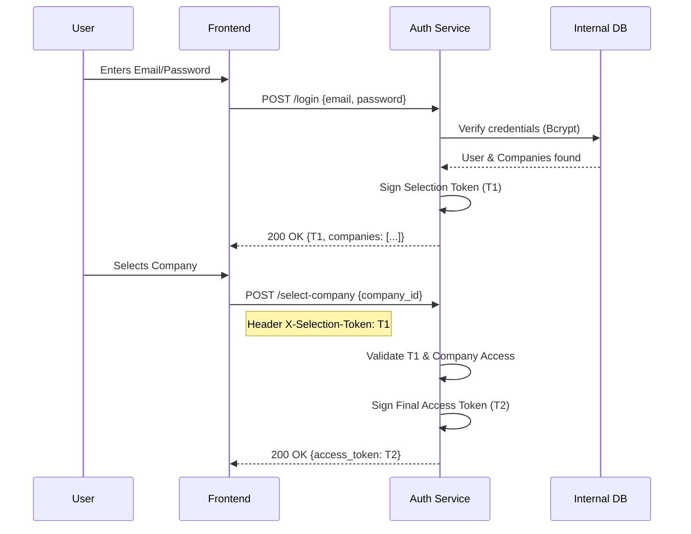

# Auth Service Use Cases & Technical Flows

This document details the operational scenarios and technical handshakes of the **Auth Service**, the identity core of InternoCore.

---

## Use Case 1: Administrative & Back-office Access
**Persona**: Administrators, Managers, Analysts.
**Credential**: Email & Password.

### Flow Description
1. **Phase 1 (Identity Handshake)**: User submits email/password.
   - **Endpoint**: `POST /api/v1/auth/login`
   - **Payload**: `{"email": "...", "password": "..."}`
   - **Result**: `selection_token` (T1) + `List<CompanyAccessDto>`.
2. **Phase 2 (Tenant Selection)**: User chooses a company from the list.
   - **Endpoint**: `POST /api/v1/auth/select-company`
   - **Header**: `X-Selection-Token: <T1>`
   - **Payload**: `{"company_id": "<UUID>"}`
   - **Result**: Final JWT (T2) with roles and permissions for that specific company.

### Sequence Diagram

---

## Use Case 2: Plant Floor & Station Access (Kiosk)
**Persona**: Operators, Warehouse Personnel, Technicians.
**Credential**: RFID Card or Employee ID + PIN.

### Flow Description
1. **Physical Identity Scan**: Operator scans their physical identity token or enters their PIN at a tablet or station.
   - **Endpoint**: `POST /api/v1/collaborator-login`
   - **Payload**: `{"identity_identifier": "RFID_UID_...", "access_method": "RFID_SCAN", "company_id": "..."}` or `{"identity_identifier": "1234", "access_method": "PIN_PAD", "internal_id": "EMP-001"}`
   - **Result**: 
     - **Path A (Single Company match)**: Returns final `access_token` directly (T2). This is the most common path for industrial floor operators.
     - **Path B (Multi-Company match)**: Returns `selection_token` (T1) + `companies` array, forcing a Tenant Selection handshake via `/select-company`.

### Technical Handshake Detail
- **Dedicated Flow**: The Kiosk flow is strictly isolated from the Web Flow to prevent mixing interactive credentials with physical tokens.
- **Auto-Resolution**: The `collaborator_login_command` automatically resolves the target tenant if the user is only assigned to one company, bypassing the two-step handshake.
- **Audit Logging**: Every kiosk login (successful or failed) is centrally audited in the `SecurityAuditLog`.

---

## Use Case 3: Monitoring & Health Analysis
**Persona**: Infrastructure, Load Balancers.

### Flow Description
1. **Health Check**: High-frequency pings to verify service availability.
   - **Endpoint**: `GET /`
   - **Result**: `{"status": "online", "service": "auth-service", "version": "..."}`

---

## Summary Table of Endpoints

| Endpoint | Method | Input | Output | Purpose |
| :--- | :--- | :--- | :--- | :--- |
| `/login` | `POST` | `email/pass` | `selection_token` + `companies` | Web Identity Verification |
| `/select-company` | `POST` | `company_id` | `access_token` (JWT) | Tenant Authorization |
| `/collaborator-login` | `POST` | `RFID` or `PIN` | `access_token` OR `selection_token` | Kiosk / Plant Floor Access |
| `/refresh` | `POST` | `refresh_token` | `access_token` | Session Extension |
| `/` | `GET` | N/A | `status: "online"` | Service Health |
