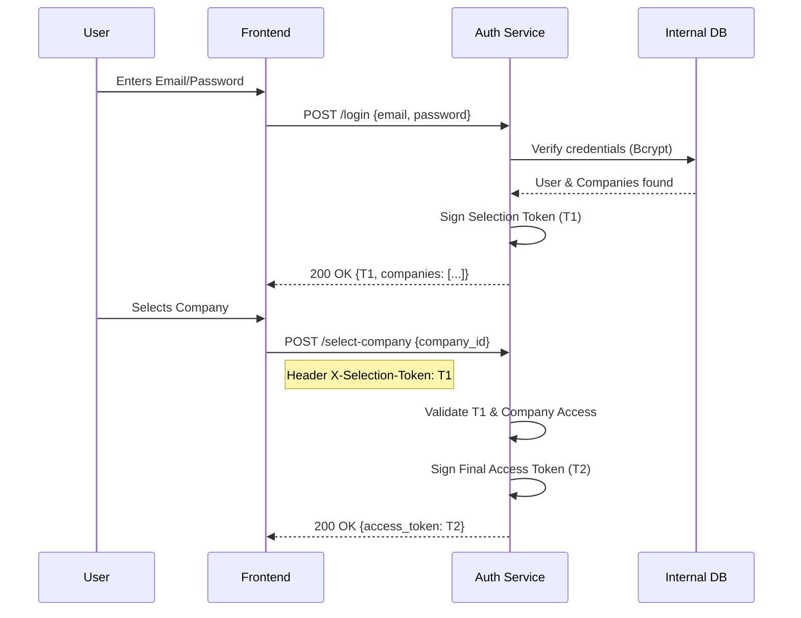

# Auth Service Use Cases & Technical Flows

This document details the operational scenarios and technical handshakes of the **Auth Service**, the identity core of InternoCore.

---

## Use Case 1: Administrative & Back-office Access
**Persona**: Administrators, Managers, Analysts.
**Credential**: Email & Password.

### Flow Description
1. **Phase 1 (Identity Handshake)**: User submits email/password.
   - **Endpoint**: `POST /api/v1/auth/login`
   - **Payload**: `{"email": "...", "password": "..."}`
   - **Result**: `selection_token` (T1) + `List<CompanyAccessDto>`.
2. **Phase 2 (Tenant Selection)**: User chooses a company from the list.
   - **Endpoint**: `POST /api/v1/auth/select-company`
   - **Header**: `X-Selection-Token: <T1>`
   - **Payload**: `{"company_id": "<UUID>"}`
   - **Result**: Final JWT (T2) with roles and permissions for that specific company.

### Sequence Diagram

---

## Use Case 2: Plant Floor & Station Access
**Persona**: Operators, Warehouse Personnel.
**Credential**: RFID Card or Barcode Badge.

### Flow Description
1. **Phase 1 (Quick Handshake)**: Operator scans their physical identity token at a tablet or station.
   - **Endpoint**: `POST /api/v1/auth/login`
   - **Payload**: `{"identity_token": "RFID_UID_..."}`
   - **Result**: `selection_token` (T1) + `List<CompanyAccessDto>`. 
   - *Note: If the operator only has access to one company (common for plant floor), the frontend can auto-trigger Phase 2.*
2. **Phase 2 (Final Handshake)**: Selection of active tenant.
   - **Endpoint**: `POST /api/v1/auth/select-company`
   - **Header**: `X-Selection-Token: <T1>`
   - **Payload**: `{"company_id": "<UUID>"}`
   - **Result**: Final JWT (T2).

### Technical Handshake Detail
- **Priority**: The header `X-Selection-Token` is extracted with priority to avoid collisions with previous valid sessions.
- **Expiry**: T1 is extremely short-lived (5 mins), while T2 is long-lived (7 days).

---

## Use Case 3: Monitoring & Health Analysis
**Persona**: Infrastructure, Load Balancers.

### Flow Description
1. **Health Check**: High-frequency pings to verify service availability.
   - **Endpoint**: `GET /`
   - **Result**: `{"status": "online", "service": "auth-service", "version": "..."}`

---

## Summary Table of Endpoints

| Endpoint | Method | Input | Output | Purpose |
| :--- | :--- | :--- | :--- | :--- |
| `/login` | `POST` | `email/pass` OR `identity_token` | `selection_token` + `companies` | Identity Verification |
| `/select-company` | `POST` | `company_id` | `access_token` (JWT) | Tenant Authorization |
| `/refresh` | `POST` | `refresh_token` | `access_token` | Session Extension |
| `/` | `GET` | N/A | `status: "online"` | Service Health |
