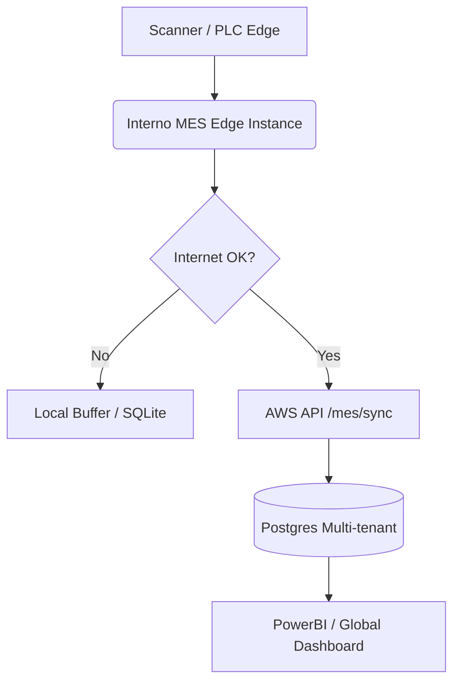

# Manual de Despliegue: Interno.Core.MES

Este documento detalla la configuración y despliegue del microservicio MES en entornos híbridos (Edge On-Premise y Cloud AWS).

## 1. Arquitectura Híbrida



## 2. Variables de Entorno (.env)

| Variable | Valor Ejemplo | Descripción |
| :--- | :--- | :--- |
| `ENVIRONMENT` | `edge` \| `cloud` | Define el comportamiento de servicios externos (ej. WMS). |
| `COMPANY_ID` | `uuid-a-b-c` | Requerido en modo Edge para inyectar a todas las transacciones. |
| `DATABASE_URL` | `postgresql+asyncpg://...` | URL de conexión a la DB local o RDS. |
| `SYNC_INTERVAL_MIN` | `5` | Frecuencia de envío de datos del Edge a la Nube. |

## 3. Despliegue con Docker Compose

```yaml
version: '3.8'
services:
  mes-service:
    image: nexosuite/mes-service:latest
    environment:
      - DATABASE_URL=postgresql+asyncpg://user:pass@db:5432/mes
      - ENVIRONMENT=edge
      - COMPANY_ID=...
    ports:
      - "8000:8000"
    depends_on:
      - db

  mes-worker:
    image: nexosuite/mes-service:latest
    command: python -m app.infrastructure.worker
    environment:
      - DATABASE_URL=postgresql+asyncpg://user:pass@db:5432/mes
    depends_on:
      - db

  db:
    image: postgres:15
    environment:
      - POSTGRES_DB=mes
      - POSTGRES_PASSWORD=...
```

## 4. Estrategia de Sincronización

1. **Edge Recovery:** Al recuperar conexión, el servicio local debe iterar el buffer de transacciones `is_synced=False`.
2. **Batch POST:** Enviar a la nube via `POST /mes/sync`.
3. **Idempotencia:** El servidor en la nube utilizará el `local_txn_id` para asegurar que no haya duplicidad.

## 5. Mantenimiento y Logs
- **Escalación:** Revisar logs del contenedor `mes-worker` para validar el disparo de alertas AL-006.
- **Audit Table:** Consultar `mes_manufacturing_ledger` para verificar el `sequence_number` por turno.
