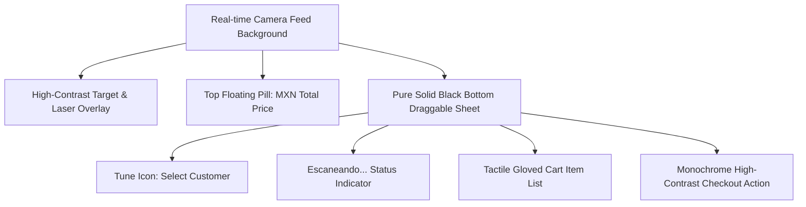

# Uber POS Layout & Interaction Specification

This document establishes the official design system, user experience guidelines, and operational architecture for the **InternoCore Sentinel Mobile POS (Sales Screen)**. This layout has been optimized for **extreme industrial environments** (such as processing plants, warehouses, and distribution centers) where operators may experience **high plant lighting (mucha luz)** and are wearing **thick protective gloves (guantes)**. It strictly follows a **minimalist, high-contrast monochrome (pure black and white) palette** inspired by the Uber driver interface.

---

## 📸 1. Visual Architecture

The visual layout implements a **1:1 Uber POS-inspired HUD (Heads-Up Display)** overlaid on a real-time augmented reality scanner feed. It uses **strictly pure blacks (#000000) and pure whites (#FFFFFF)**, avoiding color gradients, neon colors, or multi-hue accents to ensure absolute visual simplicity and maximum light-absorbing high-contrast readability in industrial floors.



### Key Dimensions & Placements:
1. **Fullscreen Camera Feed (`MobileScanner`):** Constantly active in the background to provide zero-latency operational feedback.
2. **Scanner Target Mira Alignment:** 
   - Positioned **100 pixels higher** than the true vertical center of the device screen.
   - *Rationale:* Elevating the scanner region ensures that the operator's hand holding the box/label, as well as the sliding bottom cart sheet, do not obstruct the active camera capture zone.
3. **Top Floating Header:**
   - Contains a floating black translucent pill (`Colors.black85`) displaying the real-time order total in large bold white font.
4. **Solid Pure Black Bottom Sheet (`DraggableScrollableSheet`):**
   - Implements a solid black background (`Colors.black`) that aligns with the phone's native dark nav bar.
   - Set to `initialChildSize: 0.11` and `minChildSize: 0.11` to sit perfectly flush with the bottom navigation bar when collapsed, hiding the empty divider and maximizing camera view.
   - Avoids any transparency in the list content to ensure high text contrast under intense plant lighting.

---

## 🚫 2. Continuous Scanning Guard (Industrial Safety Loop)

To prevent erratic duplicate readings caused by light reflections (luz ambiental alta) or hand trembling when holding heavy items:

```
                  ┌──────────────────────────────┐
                  │    Barcode Scan Detected     │
                  └──────────────┬───────────────┘
                                 │
                                 ▼
                   /───────────────────────────\
                  <  Already exists in cart?    >
                   \───────────────────────────/
                                 │
                        Yes      ├─────────────────► [ IGNORE SCAN / SHOW SNACKBAR ]
                                 │                    "Already in cart. Adjust manually."
                                 │
                        No       ▼
                  ┌──────────────────────────────┐
                  │ Add Product with Quantity = 1│
                  └──────────────────────────────┘
```

1. **Scan-Once Limitation:** A product can **ONLY be added once** to the shopping cart by scanning its barcode.
2. **Scan Disabling for Incrementing:** If a barcode is scanned and the product is *already* present in the cart, the system **blocks the action and does not increase the quantity**.
3. **One-Time Warning (Silent Guard):** To prevent duplicate warning SnackBars from piling up or cycling infinitely when the operator's camera remains fixed on a QR/barcode that is already in the cart, the system **only displays the warning SnackBar once** when the product is first scanned. If the same barcode is scanned continuously afterwards, the scanner **ignores it silently** without displaying additional SnackBars.
4. **Scan Throttling:** A **1.5-second cooling-down period (debounce)** is enforced on the active scanner. The same barcode scanned within 1500 milliseconds of the last successful capture is discarded.
5. **Centralized Scan Window (ScanWindow):** To avoid scanning random codes in the background (such as adjacent boxes on assembly lines or documents open on screens), the scanner uses a defined `scanWindow`. It **completely ignores** all barcodes outside the central green target box.

---

## 🛍️ 3. Simplified Product Information Card

To eliminate redundant lines of text and focus purely on essential data under low-contrast or high-light conditions:
1. **Title:** Shows **ONLY the product code** (e.g. `MPN-GAR-701`) in bold white text. No redundant names or generic titles are permitted.
2. **Price:** Displayed in the middle of the row as a bold white value (e.g. `$99.99`), indicating the total price for the item.
3. **Quantity Selector:** Retains the large, tactile touch targets (`[-] 1 [+]`) on the right.

---

## 🛝 4. Swipe to Confirm (Slide to Confirm)

Instead of a standard button, the POS implements a premium **Slide to Confirm** gesture inspired by the Uber driver application:
1. **Interactive Slider:** A track at the bottom of the sheet with the label `DESLIZAR PARA COBRAR`.
2. **Visual Feedback:** As the operator drags the white handle to the right, the slider track dynamically **paints itself green (`#000000` to `#00E676`)** following the drag progress.
3. **Action Trigger:** Upon reaching `> 85%` of the width, it snaps to completion, changes the arrow color, and triggers the checkout process.
4. **Spring-back Bounce:** If the handle is released before reaching the completion threshold, it smoothly springs back to the `0.0` start position using a spring-back transition.

## 🧤 3. Tactile Glove-Friendly Controls (User Interaction)

Since operators in the plant wear heavy safety gloves, tactile screen controls require special design parameters:

| Parameter | Specification | Industrial Purpose |
| :--- | :--- | :--- |
| **Quantity Buttons** | Large Solid Circle Icons (`Icons.remove_circle` and `Icons.add_circle`) | High contrast and easy visibility under extreme lighting. |
| **Icon Size** | Minimum **`30.0` logical pixels** | Ensures a wide, high-contrast tap zone. |
| **Touch Target Area** | Minimum **`44.0 x 44.0` logical pixels** padding boundaries | Prevents "fat-finger" errors or unresponsive taps through thick gloves. |
| **Text Readability** | Font size **`18.0` bold white text** | Clearly readable from an arm's length on the assembly line. |

### Quantity Modifier Implementation:
```dart
Row(
  children: [
    IconButton(
      icon: const Icon(Icons.remove_circle, color: Colors.white54, size: 30),
      onPressed: () => _updateQuantity(index, -1),
      padding: EdgeInsets.zero,
      constraints: const BoxConstraints(minWidth: 44, minHeight: 44),
    ),
    Padding(
      padding: const EdgeInsets.symmetric(horizontal: 10),
      child: Text(
        '${item['quantity']}',
        style: const TextStyle(color: Colors.white, fontWeight: FontWeight.bold, fontSize: 18),
      ),
    ),
    IconButton(
      icon: const Icon(Icons.add_circle, color: Colors.white, size: 30),
      onPressed: () => _updateQuantity(index, 1),
      padding: EdgeInsets.zero,
      constraints: const BoxConstraints(minWidth: 44, minHeight: 44),
    ),
  ],
)
```

## 📱 4. Programmatic Bottom Sheet Toggle

To align perfectly with the Uber POS visual flow, the bullet list icon on the right side of the bottom sheet header serves as a **one-touch toggle trigger**:

1. **Tap to Expand/Collapse:**
   - If the bottom sheet is collapsed (`size < 0.2`), tapping the bullet list icon smoothly animates the sheet up to its fully expanded state (`0.85`), showing all cart products.
   - If the sheet is expanded (`size > 0.2`), tapping the bullet list icon animates it back down to the tight collapsed state (`0.11`) flush with the bottom navigation menu.
2. **Implementation Details:**
   - Managed via a `DraggableScrollableController` in Flutter.
   - Uses `easeOutCubic` curve with a `300ms` duration for a premium, hardware-accelerated fluid motion feel.
   - The real-time camera scanner feed remains active in the background at all times, preventing camera reload latency or black screen flashes.

---

## 📝 5. Layout Freeze Policy

> [!IMPORTANT]
> **NO MODIFICATIONS ALLOWED.**
> This layout is frozen to maintain full UX certification for the industrial operator workflow. 
> Any visual or behavioral changes must explicitly conform to this document to prevent breaking field compliance.
