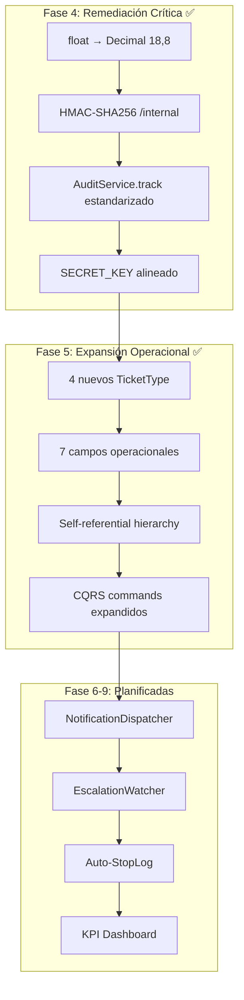

# Master Implementation History — 2026-05-01

## Sesión: Tickets Service — De Helpdesk a Motor Operacional Industrial

### Arquitectura Ejecutada

### Decisiones Arquitectónicas

| Decisión | Justificación | Impacto |
|---|---|---|
| `Numeric(18,8)` para costos | Elimina errores de redondeo binario en Kardex | Precisión financiera garantizada |
| HMAC-SHA256 en `/internal` | Bloquea falsificación de tickets por servicios comprometidos | Seguridad inter-servicio |
| `parent_ticket_id` self-ref FK | Permite cadenas de escalación ilimitadas | Flexibilidad operacional |
| `escalation_level` como Integer | Simple, extensible, compatible con ESCALATION_MATRIX | Performance en queries |
| `resolved_at` con timezone | Cálculo preciso de MTTR across timezones | Métricas industriales confiables |
| `auto_close_on_event` como String | Patrón extensible para futuros eventos de cierre | Desacoplamiento |
| Suscripciones 10 años (dev) | Evita bloqueos por middleware en desarrollo | Productividad |

### Archivos Modificados

#### Fase 4 (Remediación)
| Archivo | Cambio |
|---|---|
| `tickets_service/app/models/ticket.py` | `cost_estimate`: `float` → `Numeric(18, 8)` |
| `tickets_service/app/schemas/ticket_dto.py` | `cost_estimate`: `float` → `Decimal` |
| `tickets_service/app/services/ticket_commands.py` | `audit_repo` → `AuditService.track()`, `quantity` → `Decimal` |
| `tickets_service/app/routers/ticket_routes.py` | HMAC validation + AuditService logging |
| `common/services/audit_service.py` | Método `.track()` añadido |
| `docker-compose.yml` | `SECRET_KEY=changeme` → `DEV_SECRET_KEY_CAMBIAME_EN_PROD_12345` |
| `subscription_service/scripts/seed.py` | `timedelta(days=365)` → `timedelta(days=3650)` |

#### Fase 5 (Expansión)
| Archivo | Cambio |
|---|---|
| `tickets_service/app/core/constants.py` | +4 `TicketType` enums |
| `tickets_service/app/models/ticket.py` | +7 campos, +2 relationships (self-ref) |
| `tickets_service/app/schemas/ticket_dto.py` | DTOs expandidos (backward compatible) |
| `tickets_service/app/schemas/internal_ticket.py` | +3 campos opcionales |
| `tickets_service/app/services/ticket_commands.py` | `CreateTicketCommand` +6 campos, handler propagación |
| `tickets_service/app/services/ticket_service.py` | `create_internal_ticket_with_debouncing` +3 campos |

### Validaciones Ejecutadas

| Test | Método | Resultado |
|---|---|---|
| Barrera HMAC | HTTP POST con firma inválida | ✅ `403 Forbidden` |
| Precisión Decimal | DTO con `0.00000001` | ✅ Sin truncamiento |
| Auditoría forense | AuditService.track en 403 | ✅ Logs generados |
| Docker Build | `docker-compose up --build` | ✅ Uvicorn healthy |
| Backward Compat | Enums expandidos, campos Optional | ✅ No breaking changes |

### Próxima Sesión

**Prioridad:** Fase 6 (Notificaciones) — Requiere:
1. `NotificationDispatcher` con Outbox Pattern
2. `TicketStatusChangedEvent` en integration_events.py
3. Endpoint `/internal/confirm-kardex-entry` para auto-cierre
4. Migración Alembic para los 7 nuevos campos de Fase 5
