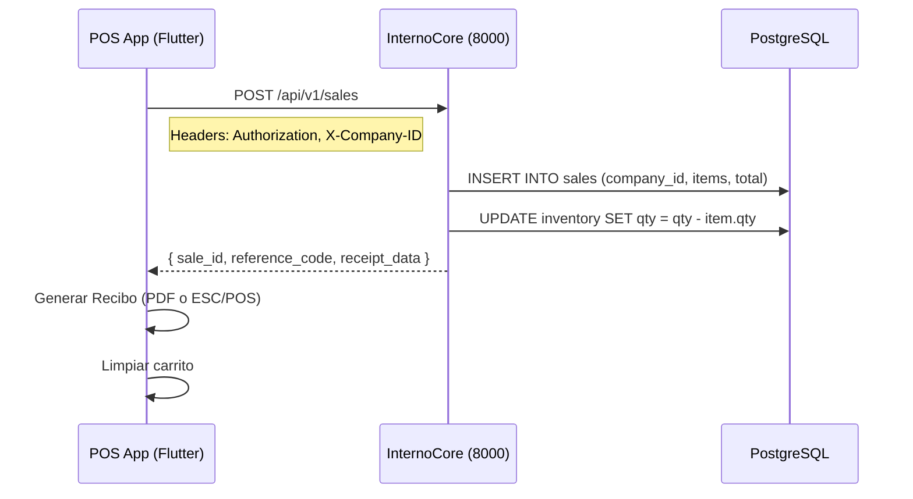

# 🏭 InternoCore POS — Plan de Implementación
## App de Recibos con Escaneo de Código de Barras (Flutter + Python Backend)

---

## 📌 Objetivo
Construir una aplicación móvil Android (Flutter) que permita a operadores escanear productos por código de barras/SKU, acumularlos en un carrito, cerrar la venta y generar un recibo imprimible o digital. Totalmente integrada con el ecosistema **InternoCore** (multitenancy, precios por lista, descuento de stock).

> [!IMPORTANT]
> La app debe respetar la arquitectura existente: `MultiTenantBase`, `Money` value object, y el filtro obligatorio por `company_id` en cada operación.

---

## 🔧 Estado del Entorno

| Herramienta | Estado | Ruta / Versión |
|---|---|---|
| Flutter SDK | ✅ Instalado | `C:\API\Flutter\flutter\bin` (v3.38.5) |
| Dart SDK | ✅ Incluido | v3.10.4 |
| Android Licenses | ✅ Aceptadas | `flutter doctor --android-licenses` |
| Proyecto Base | ✅ Creado | `c:\API\interno\interno_billing_app` |
| Backend InternoCore | ✅ Operativo | Puerto 8000 (Monolito) |
| PATH de Flutter | ✅ Configurado | Variable de usuario actualizada |

---

## 🏗️ Arquitectura

### Estructura de Carpetas (Clean Architecture en Dart)

```
interno_billing_app/lib/
├── core/
│   ├── config/
│   │   └── api_config.dart          # Base URL, headers, company_id
│   ├── di/
│   │   └── injection.dart           # Service Locator (get_it)
│   ├── theme/
│   │   └── app_theme.dart           # Colores InternoCore (cyan, slate, glass)
│   └── models/
│       └── api_response.dart        # Wrapper {status, data, message, meta}
│
├── features/
│   ├── auth/
│   │   ├── data/
│   │   │   └── auth_repository.dart
│   │   ├── domain/
│   │   │   └── auth_entity.dart
│   │   └── presentation/
│   │       └── login_screen.dart
│   │
│   ├── scanner/
│   │   ├── data/
│   │   │   ├── models/
│   │   │   │   ├── product_model.dart
│   │   │   │   └── price_model.dart
│   │   │   └── repositories/
│   │   │       └── product_repository.dart
│   │   ├── domain/
│   │   │   ├── entities/
│   │   │   │   ├── product.dart
│   │   │   │   └── cart_item.dart
│   │   │   └── usecases/
│   │   │       ├── lookup_product.dart
│   │   │       └── add_to_cart.dart
│   │   └── presentation/
│   │       ├── scanner_screen.dart      # Cámara + overlay
│   │       ├── widgets/
│   │       │   ├── scan_overlay.dart    # Bounding box visual
│   │       │   └── cart_item_tile.dart  # Fila de producto
│   │       └── bloc/
│   │           └── scanner_bloc.dart
│   │
│   └── checkout/
│       ├── data/
│       │   └── sale_repository.dart
│       ├── domain/
│       │   ├── entities/
│       │   │   └── sale.dart
│       │   └── usecases/
│       │       └── process_sale.dart
│       └── presentation/
│           ├── review_order_screen.dart  # Resumen + botón de pago
│           └── receipt_screen.dart       # PDF / ESC-POS
│
└── main.dart
```

---

## 📊 Mapeo con Modelos Existentes del Backend

### Product (Backend → Flutter)

| Campo Backend (`Product`) | Campo Flutter (`ProductModel`) | Notas |
|---|---|---|
| `id` (UUID) | `id` (String) | Heredado de `BaseEntity` |
| `sku` (String 100) | `sku` (String) | **Identificador de escaneo primario** |
| `code` (String 45) | `code` (String?) | Legacy code / barcode alternativo |
| `name` (String 255) | `name` (String) | De `BaseCatalogEntity` |
| `company_id` (UUID) | `companyId` (String) | Filtro multitenancy obligatorio |
| `is_taxable` (bool) | `isTaxable` (bool) | Para cálculo de IVA al checkout |
| `allow_price_override` (bool) | `allowPriceOverride` (bool) | Modo "Areli" |
| `photo_path` (String?) | `photoUrl` (String?) | Foto del producto |

### ProductPrice (Backend → Flutter)

| Campo Backend (`ProductPrice`) | Campo Flutter (`PriceModel`) | Notas |
|---|---|---|
| `amount` (Decimal 12,4) | `amount` (double) | Precio neto (sin IVA) |
| `currency` (String 3) | `currency` (String) | `"MXN"` o `"USD"` |
| `price_list_index` (int) | `priceListIndex` (int) | Lista 1=General, 2=Mayoreo... |
| `unit_type` (Enum) | `unitType` (String) | `"BASE"` / `"SALE"` |
| `warehouse_id` (UUID?) | `warehouseId` (String?) | NULL = precio global |

---

## 📋 Fases de Implementación

### Phase 1: Setup del Entorno Flutter (30 min)

```powershell
# 1. Entrar al proyecto
cd c:\API\interno\interno_billing_app

# 2. Instalar dependencias críticas
flutter pub add mobile_scanner      # Escáner de códigos de barras
flutter pub add dio                 # HTTP client robusto
flutter pub add get_it              # Inyección de dependencias
flutter pub add flutter_bloc        # State management
flutter pub add equatable           # Comparación de objetos
flutter pub add google_fonts        # Tipografía Inter/Outfit
flutter pub add intl                # Formato de moneda/fecha
flutter pub add shared_preferences  # Persistencia del carrito offline

# 3. Dependencias opcionales (Phase 5)
flutter pub add pdf                 # Generación de recibos PDF
flutter pub add printing            # Impresión directa
flutter pub add blue_thermal_printer # Impresora térmica BT (ESC/POS)
```

**Permisos Android** — Editar `android/app/src/main/AndroidManifest.xml`:
```xml
<!-- Antes de <application> -->
<uses-permission android:name="android.permission.CAMERA" />
<uses-permission android:name="android.permission.INTERNET" />
<uses-permission android:name="android.permission.BLUETOOTH" />
<uses-permission android:name="android.permission.BLUETOOTH_CONNECT" />
```

**Min SDK** — Editar `android/app/build.gradle`:
```gradle
defaultConfig {
    minSdk = 24  // Requerido por mobile_scanner
}
```

---

### Phase 2: Backend — Endpoint de Búsqueda por SKU/Barcode (1-2 hrs)

> [!NOTE]
> El modelo `Product` ya existe en `master_data_service` con campos `sku` y `code`. Solo necesitamos un nuevo endpoint optimizado para lookup rápido desde el móvil.

**Nuevo endpoint en** `master_data_service/master_app/api/v1/endpoints/products.py`:

```python
@router.get("/lookup/{code}", response_model=ApiResponse)
async def lookup_product_by_code(
    code: str,
    db: AsyncSession = Depends(get_db),
    user: TokenPayload = Depends(get_current_user)
):
    """
    [POS Phase 1] Búsqueda rápida de producto por SKU o código legacy.
    Retorna el producto con su precio activo de Lista 1 (General).
    Usado por la app móvil de escaneo.
    """
    company_id = uuid.UUID(user.company_id)
    
    # Buscar por SKU o por código legacy
    stmt = (
        select(Product)
        .options(selectinload(Product.prices))
        .where(
            Product.company_id == company_id,
            Product.is_active == True,
            or_(
                Product.sku == code,
                Product.code == code
            )
        )
    )
    result = await db.execute(stmt)
    product = result.scalar_one_or_none()
    
    if not product:
        raise HTTPException(404, detail=f"Producto '{code}' no encontrado")
    
    # Resolver precio activo (Lista 1, SALE, global)
    active_price = next(
        (p for p in product.prices 
         if p.is_active and p.price_list_index == 1 
         and p.unit_type.value == "SALE" 
         and p.valid_until is None),
        None
    )
    
    return ApiResponse(data={
        "id": str(product.id),
        "sku": product.sku,
        "code": product.code,
        "name": product.name,
        "photo_url": product.photo_path,
        "is_taxable": product.is_taxable,
        "allow_price_override": product.allow_price_override,
        "price": {
            "amount": float(active_price._amount) if active_price else 0.0,
            "currency": active_price._currency if active_price else "MXN"
        }
    })
```

**Nuevo Command — Procesar Venta** en `inventory_service`:

```python
# POST /api/v1/sales
class ProcessSaleCommand(BaseModel):
    items: List[SaleItemDTO]
    payment_method: str = "CASH"
    notes: Optional[str] = None

class SaleItemDTO(BaseModel):
    product_id: uuid.UUID
    sku: str
    quantity: int
    unit_price: float  # Precio al momento de la venta (snapshot)
    currency: str = "MXN"
```

---

### Phase 3: Flutter — Pantalla del Scanner (2-3 hrs)

**Referencia de UI** (basada en la imagen proporcionada):

```
┌──────────────────────────────┐
│   [📷 Vista de Cámara]      │  ← 40% superior
│   ┌────────────────────┐     │
│   │  ▄▄▄▄▄▄▄▄▄▄▄▄▄▄▄  │     │  ← Bounding box overlay
│   │  ▀▀▀▀▀▀▀▀▀▀▀▀▀▀▀  │     │
│   └────────────────────┘     │
├──────────────────────────────┤
│ Scanned Items         $52.00 │  ← Header del carrito
├──────────────────────────────┤
│ 🍫 Snickers       x2  $1.00 │  ← CartItemTile
│ 🥤 Coca-Cola      x1  $1.50 │
│ 🧴 Shampoo        x1 $22.00 │
│ 🥫 Beans          x3  $3.50 │
├──────────────────────────────┤
│  [     📋 Review Order     ] │  ← Botón principal
└──────────────────────────────┘
```

**Comportamiento clave del Scanner:**

| Feature | Implementación |
|---|---|
| Debounce | 1.5s entre escaneos para evitar lecturas duplicadas |
| Agrupación | Si el SKU ya está en el carrito, incrementar `quantity` |
| Haptic Feedback | Vibración corta al detectar un código exitoso |
| Flash Control | Botón de linterna para ambientes oscuros |
| Audio Feedback | Sonido "beep" confirmatorio |
| Offline Buffer | Si la red falla, guardar en `SharedPreferences` |

---

### Phase 4: Flutter — Checkout y Cierre de Venta (2 hrs)

**Pantalla Review Order:**
- Resumen con lista de productos, cantidades editables y total
- Selector de método de pago: Efectivo / Tarjeta / Transferencia
- Campo opcional de notas
- Botón "Confirmar Venta" → `POST /api/v1/sales`
- Cálculo de IVA en tiempo real (16% MX / variable por producto)

**Flujo de cierre:**



---

### Phase 5: Recibos — Impresión y PDF (1-2 hrs)

**Opciones de salida:**

| Método | Tecnología | Caso de Uso |
|---|---|---|
| PDF Digital | `pdf` + `printing` packages | Envío por email / WhatsApp |
| Impresora Térmica | `blue_thermal_printer` (ESC/POS) | POS físico en tienda |
| Vista en Pantalla | Widget nativo Flutter | Confirmación visual |

**Formato del Recibo:**
```
═══════════════════════════════
    INTERNO CORE POS
    [Nombre de Empresa]
    RFC: XXXX000000XXX
═══════════════════════════════
Fecha: 2026-05-08 11:22:00
Folio: VTA-2026-0001
Cajero: Charly Flores
───────────────────────────────
2x Snickers          $2.00
1x Coca-Cola         $1.50
1x Shampoo          $22.00
3x Frijoles          $10.50
───────────────────────────────
Subtotal:            $36.00
IVA (16%):            $5.76
TOTAL:               $41.76
Método: EFECTIVO
───────────────────────────────
    ¡Gracias por su compra!
    www.internocore.com
═══════════════════════════════
```

---

## 🗓️ Cronograma Estimado

| Fase | Duración | Dependencia | Entregable |
|---|---|---|---|
| **Phase 1**: Setup Flutter + deps | 30 min | Ninguna | Proyecto compilable con deps |
| **Phase 2**: Backend lookup + sale | 1-2 hrs | Phase 1 | Endpoints `/lookup/{code}` y `/sales` |
| **Phase 3**: Scanner UI + Cart | 2-3 hrs | Phase 2 | Pantalla funcional con cámara |
| **Phase 4**: Checkout + Stock | 2 hrs | Phase 3 | Cierre de venta E2E |
| **Phase 5**: Recibos PDF/Térmica | 1-2 hrs | Phase 4 | Generación de recibo |

**Total estimado: 7-10 horas de desarrollo**

---

## 🔐 Consideraciones de Seguridad (InternoCore Compliance)

- **JWT obligatorio**: Cada petición al backend incluye `Authorization: Bearer <token>`
- **X-Company-ID**: Header obligatorio para filtro multitenancy
- **company_id validation**: El backend SIEMPRE filtra por `company_id` — nunca se expone data de otro tenant
- **Token expiration**: La app debe manejar refresh tokens (RTR) igual que el frontend Angular
- **Offline mode**: Los datos en caché local se encriptan con el `company_id` como salt

---

## 🎨 Design System (Consistencia con InternoCore)

```dart
// app_theme.dart — Tokens del design system
class InternoColors {
  static const cyan = Color(0xFF22D3EE);       // --ic-cyan
  static const darkBg = Color(0xFF0F172A);      // --ic-dark
  static const surfaceGlass = Color(0xB30F172A); // rgba(15,23,42,0.7)
  static const borderGlass = Color(0x1AFFFFFF);  // rgba(255,255,255,0.1)
  static const slateText = Color(0xFF94A3B8);
  static const successGreen = Color(0xFF22C55E);
  static const warningAmber = Color(0xFFF59E0B);
  static const errorRed = Color(0xFFEF4444);
}
```

---

## 📎 Referencias Clave

| Archivo | Propósito |
|---|---|
| [Product model](file:///c:/API/interno/backend/master_data_service/master_app/models/product.py) | Modelo SQLAlchemy con `sku`, `code`, `is_taxable` |
| [ProductPrice model](file:///c:/API/interno/backend/master_data_service/master_app/models/product_price.py) | 10 listas de precios + Money VO |
| [BaseProduct](file:///c:/API/interno/backend/common/models/catalogs.py#L34-L52) | Herencia `sku`, `status`, `photo_path` |
| [BillingService (Angular)](file:///c:/API/interno/frontend/src/app/core/services/billing.service.ts) | Patrón de `createCheckoutSession` para referencia |
| [AuthService (Angular)](file:///c:/API/interno/frontend/src/app/core/services/auth.service.ts) | Flujo T1→T2 para replicar en Flutter |
| [Referencia UI](file:///c:/API/interno/archive/unnamed.jpg) | Imagen de diseño objetivo |
